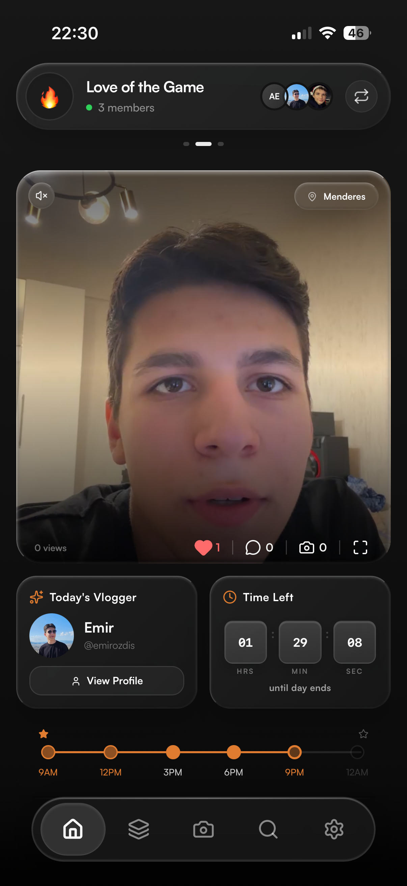
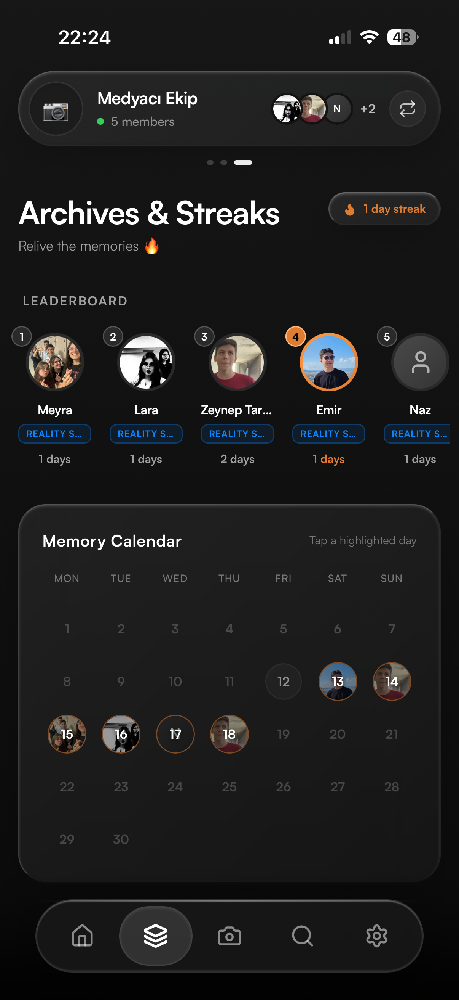

# MyTurn: Authentic Daily Vlogging for Close Friends


MyTurn is a unique Progressive Web App (PWA) designed to bring close friends closer through authentic, daily video vlogging. In a world saturated with performance-driven social media, MyTurn offers a refreshing, private space where one person is randomly selected each day to share snippets of their life, fostering genuine connection without the pressure of likes or public validation.

## ✨ Features

*   **Daily Vlogger Assignment**: A fair, randomized system picks one group member each day to be the designated vlogger.
*   **Short-Form Video Clips**: Capture and share multiple short video moments throughout your day, building a chronological story.


*   **Private Group Sharing**: All content is exclusively shared within invite-only friend groups, ensuring privacy and intimacy.
*   **Interactive Engagement**: Engage with friends' vlogs through likes, comments, and unique photo responses.
*   **Streaks & Achievements**: Gamified elements encourage consistent participation and celebrate milestones.


*   **Real-time Push Notifications**: Stay updated with alerts for your turn, new posts from friends, and daily recap compilations.


*   **Progressive Web App (PWA)**: Enjoy a native-like mobile experience with installability, offline capabilities, and direct camera/microphone access.
*   **Personalized Profiles**: Showcase your vlogging journey with XP, archetypes, and a history of your shared moments.
*   **Seamless Group Management**: Easily create, join, and leave groups using unique invite codes.
*   **Adaptive Streaming (HLS)**: Videos are transcoded server-side to HLS for optimal streaming quality across various network conditions.
*   **Location Context**: Optionally tag locations to add context to your daily vlogs.
*   **Circadian Event Management**: Intelligent system for daily event rollouts, countdowns, and "sleep mode" based on group timezones.

## 🚀 Technologies Used

*   **Frontend**: Next.js, React, TypeScript, Tailwind CSS, Framer Motion (animations), Lucide React (icons).
*   **Backend**: Next.js (API Routes & Server Actions), TypeScript, Node.js.
*   **Database**: PostgreSQL (managed with Prisma ORM).
*   **Authentication**: NextAuth.js (supporting Credentials, Google, and Apple logins).
*   **Media Storage**: Supabase Storage for secure and scalable asset management.
*   **Video Processing**: FFmpeg (server-side for HLS transcoding and thumbnail generation).
*   **Deployment**: Optimized for Vercel (Next.js hosting) and Supabase (database & storage).

## 🏗️ Architecture Overview

MyTurn is built as a modern full-stack Next.js application. The frontend delivers a highly interactive and animated user interface, prioritizing a mobile-first, PWA-centric experience. Backend logic is robustly handled by Next.js Server Actions and API Routes, ensuring secure and efficient data operations. Prisma ORM provides a type-safe interface to the PostgreSQL database. Critical media processing, such as video transcoding to HLS and dynamic thumbnail generation, is offloaded to server-side Node.js cron jobs utilizing FFmpeg, ensuring smooth playback and efficient storage. Authentication is powered by NextAuth.js, providing flexible login options.

## ⚙️ Setup and Installation

To get a local copy up and running, follow these steps:

1.  **Clone the repository**:
    ```bash
    git clone https://github.com/emirozdis/vlog.git
    cd vlog
    ```
2.  **Install dependencies**:
    ```bash
    npm install
    # or
    yarn install
    ```
3.  **Set up environment variables**:
    Create a `.env` file in the root directory and populate it with necessary keys (e.g., `DATABASE_URL`, `NEXTAUTH_SECRET`, `GOOGLE_CLIENT_ID`, `SUPABASE_URL`, `SUPABASE_SERVICE_ROLE_KEY`, `VAPID_PRIVATE_KEY`, etc.). Refer to `.env.example` if available.
4.  **Database Migration**:
    ```bash
    npx prisma migrate dev
    ```
5.  **Start the development server**:
    ```bash
    npm run dev
    # or
    yarn dev
    ```
    Open [http://localhost:3000](http://localhost:3000) in your browser.

## 🤝 Contributing

MyTurn is currently a solo developer project. While direct contributions might be limited during the closed beta phase, feedback and suggestions are always welcome! Please open an issue on GitHub for any bugs or feature requests.

## 📄 License

This project is licensed under the MIT License.
